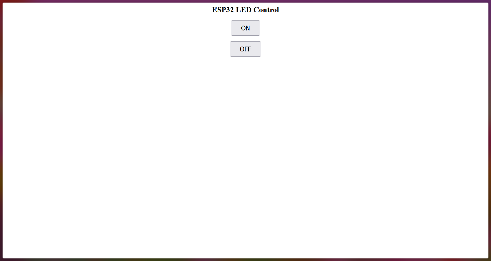

Malmö University

Internet of Things and People

Lab 5

# Task 1

## Result 2

I changed the line `Serial.begin(115200);` in the provided code to `Serial.begin(9600);` and set the Serial Monitor baud-rate to match. The following is the Serial Monitor output of the final attempt.

```
����������������������������������������������������������������ello Wo����������������������������������������������������������������ld!
I can receive just fine!
Wait, no I can send just fine too!
����������������������������������������������������������������t first I realised that the baud rate in the serial monitor mismatched the baud rate in the code. I first changed both to 115200 which resulted only in empty square symbols. Then, I changed both to 9600. Then, we got this result :)
Hmm... The upper-case 'A' got scrambled still. I wonder what causes that...
```

# Task 2

1. Ran the provided webserver code
2. Connected to the wi-fi emitted by the ESP32
3. Connected to the webserver (`192.168.4.1`)


